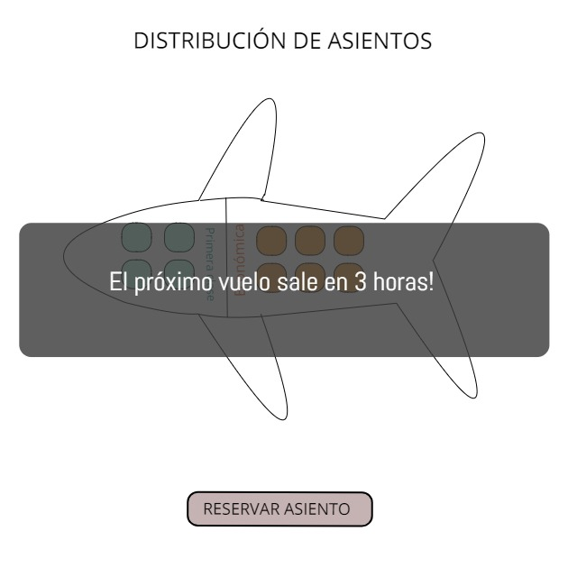

# ♡ RESERVA BOLETOS DE AVIÓN ♡

ENUNCIADOS
Al igual que hemos hecho antes, es hora de aplicar los conceptos aprendidos para resolver problemas.

A continuación tendrás varios problemas que debes resolver. Intenta resolverlos primero por tu cuenta. Más abajo encontrarás las soluciones.

Después de haberlo intentado, compara tus soluciones con los videos de abajo.

NO antes.

1. RESERVA DE PUESTOS AEROLÍNEA
Una pequeña aerolínea acaba de comprar una computadora para su nuevo sistema de reservaciones automatizadas. Se te ha pedido que desarrolles el nuevo sistema. Escribirás una aplicación para asignar asientos en cada vuelo del único avión de la aerolínea (capacidad: 10 asientos).

Tu aplicación debe mostrar las siguientes alternativas:

Por favor escriba 1 para Primera Clase y Por favor escriba 2 para Económico.

Si el usuario escribe 1, tu aplicación debe asignarle un asiento en la sección de primera clase (asientos 1 a 4). Si el usuario escribe 2, tu aplicación debe asignarle un asiento en la sección económica (asientos 5 a 10).

Tu aplicación deberá entonces imprimir un pase de abordar, indicando el número de asiento de la persona y si se encuentra en la sección de primera clase o clase económica.

# TIPS PARA LA SOLUCIÓN
A continuación, encontrarás tips que podrían ayudarte con la solución, ¡mucha suerte!

# [TIP. | DIAGRAMA DE FLUJO]

# [TIP. | REPRESENTACIÓN USANDO ARRAYS]
Usa un arreglo unidimensional del tipo booleano para representar la tabla de asientos del avión. Inicializa todos los elementos del arreglo con -false- para indicar que todos los asientos están vacíos. A medida que se asigne cada asiento, establezca el elemento correspondiente del arreglo en true para indicar que ese asiento ya no está disponible.

Tu aplicación nunca deberá asignar un asiento que ya haya sido asignado. Cuando esté llena la sección económica o primera clase, tu programa deberá preguntar a la persona si acepta ser colocada en la sección de primera clase (y viceversa).

Si la persona acepta, haga la asignación de asiento apropiada.

Si no, debe imprimir el mensaje “El próximo vuelo sale en 3 horas”.

